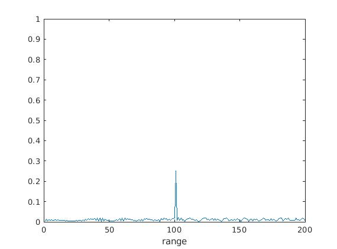
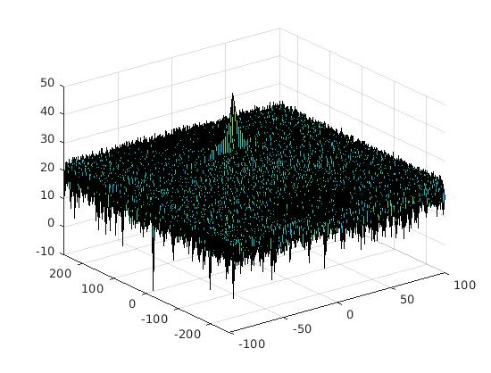

# SFND Radar Target Generation and Detection

This document contians the documentation for the final project in the SFND Radar module.

## FMCW Waveform Design

See code from line 27 of `radar_target_generation.m`.

## Simulation Loop

See code from line 62 of `radar_target_generation.m`.

## Range FFT (1st FFT)

See code from line 84 of `radar_target_generation.m`.

The plots below shows the Range FFT and the Range Doppler Map (RDM) with the initial target range of `100m` and constant velocity of `10m/s`.

### Range FFT Plot

### Range Doppler Map

## 2D CFAR

See code from line 141 of `radar_target_generation.m`.
