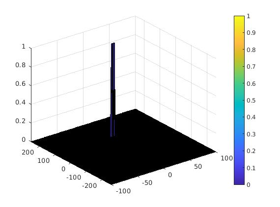

# SFND Radar Target Generation and Detection

This document contians the documentation for the final project in the SFND Radar module.

## FMCW Waveform Design

See code from line 27 of `radar_target_generation.m`.

## Simulation Loop

See code from line 62 of `radar_target_generation.m`.

## Range FFT (1st FFT)

See code from line 84 of `radar_target_generation.m`.

The plots below shows the Range FFT and the Range Doppler Map (RDM) with the initial target range of `100m` and constant velocity of `10m/s`.

### Range FFT Plot

### Range Doppler Map

## 2D CFAR

See code from line 141 of `radar_target_generation.m`.

### Implementation

Following the lesson and the project walk-through...

- First, the training, guard cell, and threshold offset were set.

- Then, the output CFAR matrix was initialized with the same size as the RDM, and with values all set to 0

- The main logic is to iterate through each cell, CUT, in the CFAR matrix with the training and guard cell as padding on the outer edge while iterating. For each CUT...
    - average the power level of all the surrounding training cells
    - add the threshold offset to the average noise level to calculate the threshold value
    - Set the output CFAR matrix value to 1 if the CUT is greater than the threshold value, else set it to 0

### Selection of Training, Guard Cells, and Offset

The default values used in the project walkthrough was used initially.

This already provided good detection result since there is only one target and the target signal power is much greater than the noise. Also, the noise level is the same across the whole grid. There are no targets that may be hidden using a fixed threshold value.

But it was observed that the Doppler velocity detection is wide, having detections for targets w/ velocities in the range of 0m/s~20m/s. To reduce this wide detection range, I looked at the Doppler Map values, and compared the power difference between the peak and the adjacent detections. I then increased the threshold offset SNR value to suppress some of the detections adjacent to the peak.

### Steps taken to suppress the non-thresholded cells at the edges

This was achieved by initializing the 2D CFAR matrix to zero before running the CFAR window.

### Plot

